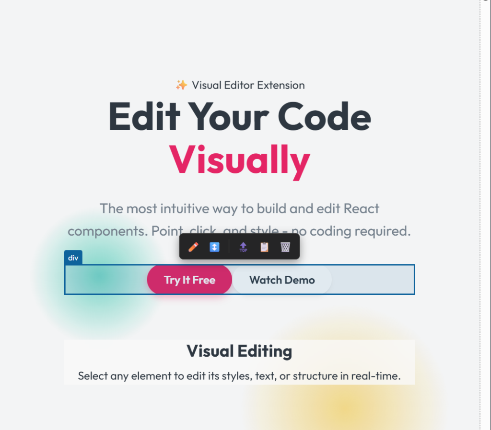
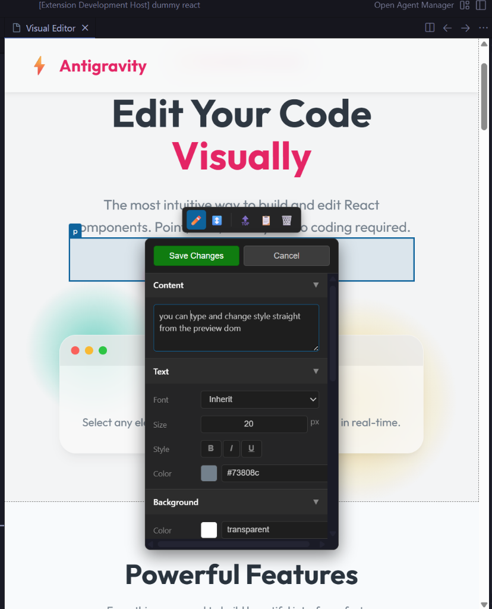
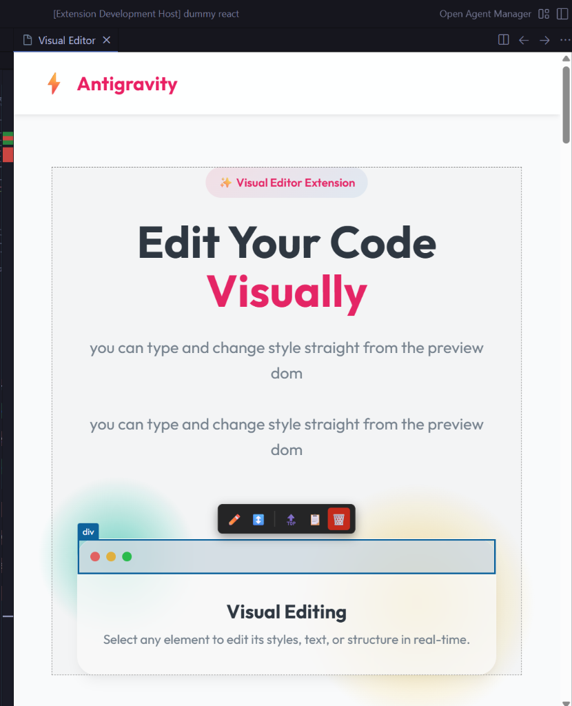
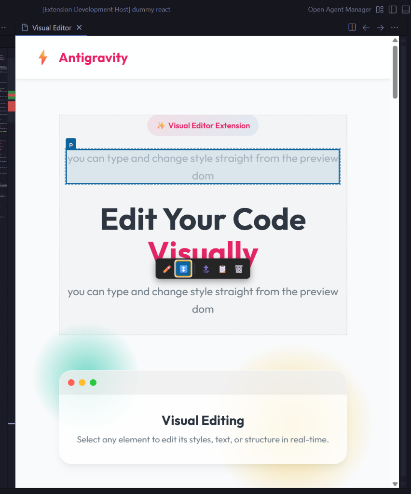
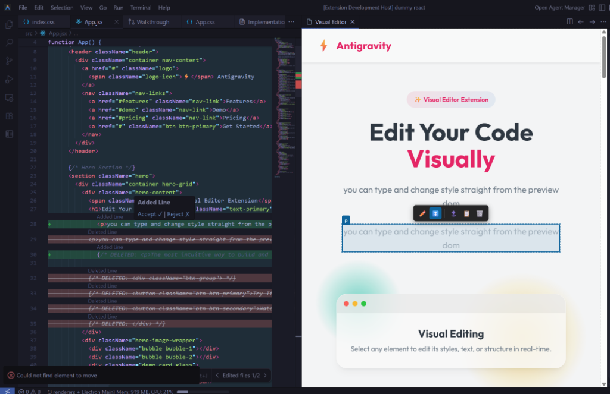
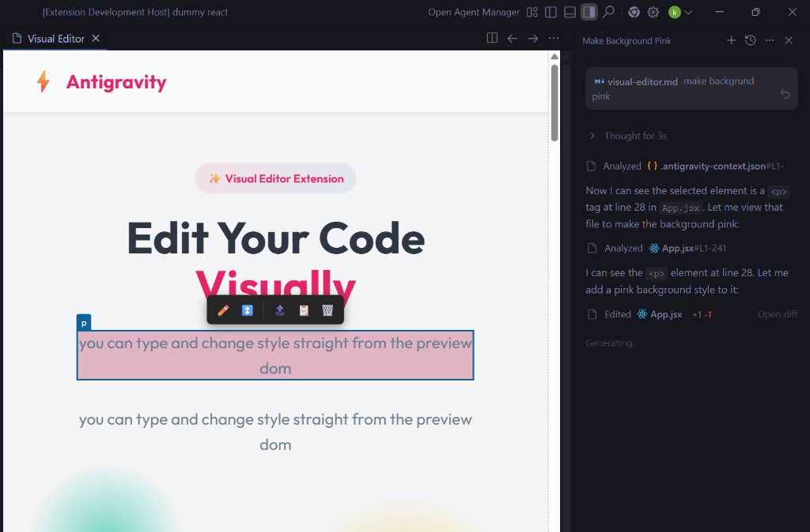

# Antigravity Visual Editor

**A powerful visual editing extension for Antigravity VS Code that brings Lovable-like WYSIWYG editing to your workflow.**

Focus on design without losing control of your code. Antigravity bridges the gap between visual design and source code, allowing you to edit HTML and React components visually while keeping your code clean and sync-able.

---

## 📸 Screenshots

### Visual Editor Overview
Select any element to see the floating toolbar with editing options.

### Style Menu
Edit typography, colors, spacing, and more from the intuitive style panel.

### Duplicate & Delete
One-click duplication and deletion with instant preview updates.

### Drag & Drop Rearrangement
Move elements freely with visual feedback.

### Code Diff Preview
Review all changes before applying - additions in green, deletions in red.

### AI Context Workflow
The AI reads the selected element's context and applies changes to the exact source location.

---

## ✨ Key Features

### 🖼️ Real-Time Preview
- Live preview of your HTML and **React components**
- Automatic Vite dev server integration for React projects
- Hot Module Replacement (HMR) for instant updates

### 🎨 Advanced Style Panel
- Visually edit CSS (Typography, Spacing, Backgrounds, Borders) without memorizing syntax
- Changes buffered until you save - preview without commitment
- Works with both HTML and React/JSX components

### 🖱️ Drag & Drop Rearrangement
- **Unified drag-and-drop** for both HTML and React elements
- Visual feedback during drag (semi-transparent with dashed outline)
- Live rearrangement - see elements move as you drag
- Click ↕️ to enter drag mode, then drag to reorder

### ✏️ Inline Text Editing
- Edit text content directly in the Style Panel
- Changes sync to source code (both HTML and JSX)

### 📋 Duplicate & 🗑️ Delete
- One-click duplication of elements
- Delete elements safely with diff preview
- Works on both HTML and React components

### 🤖 AI Agent Integration
- Seamless context sharing via `.antigravity-context.json`
- Tell your AI agent "Make this blue" or "Duplicate this" by selecting elements for context
- Use `/visual-editor` workflow command

### 🛡️ Safe Diff Preview
- Review all changes before they're applied
- Visual highlighting of additions (green) and deletions (red)
- Accept or Reject changes with one click
- Batched editing - make multiple changes, apply all at once

---

## 📥 Installation

### From VSIX (Manual)
1. Obtain the `.vsix` file package.
2. Open VS Code and go to the **Extensions** view (`Ctrl+Shift+X`).
3. Click the `...` menu in the top-right corner.
4. Select **Install from VSIX...**.
5. Choose the `antigravity-visual-editor-0.1.0.vsix` file.

---

## 🚀 Getting Started

### For HTML Files
1. Open any `.html` file.
2. Run **"Antigravity: Open Visual Editor"** from Command Palette (`Ctrl+Shift+P`).
3. Start editing visually!

### For React Projects
1. Open a React component (`.jsx`/`.tsx`) in a project with `package.json`.
2. Run **"Antigravity: Open Visual Editor"**.
3. The extension automatically:
   - Detects it's a React project
   - Starts a Vite dev server
   - Opens a live preview with HMR
4. Edit visually - changes sync to your source code!

---

## 🎨 Using the Visual Editor

### Selection & Context
- **Click** any element in the preview to select it
- A **context toolbar** appears with action buttons
- The `.antigravity-context.json` file updates automatically for AI integration

### Toolbar Actions
| Button | Action |
|:---:|:---|
| ✏️ | Open Style Panel |
| ↕️ | Enter drag-to-rearrange mode |
| 🔝 | Select parent element |
| 📋 | Duplicate element |
| 🗑️ | Delete element |

### Style Panel
- **Typography**: Font size, weight, style, color
- **Spacing**: Padding and margin controls
- **Background**: Color picker
- **Borders**: Width, style, color, radius
- Click **Save** to apply, **Cancel** to revert

### Drag & Drop
1. Select an element
2. Click the ↕️ button (element becomes semi-transparent)
3. Click and drag up/down to reorder
4. Release to finalize - source code updates automatically

---

## 🤖 AI Agent Integration

Antigravity is designed to be the "eyes" for your AI coding assistant.

### The "Click-and-Chat" Workflow
1. **Select** an element in the Visual Editor
2. Switch to your AI Agent
3. **Command It** using `/visual-editor`:
   - *"/visual-editor Make this button have a red background"*
   - *"/visual-editor Duplicate this card three times"*
   - *"/visual-editor Add 20px padding to this container"*

### How It Works

1. **Select** an element → Antigravity writes its details to `.antigravity-context.json`
2. **AI Reads Context** → Learns the element's tag, classes, styles, and **exact source location**
3. **Precise Edits** → AI opens the correct file and applies changes directly to the right element

This enables natural commands like *"make background pink"* - the AI knows exactly which element you mean!

---

## ⌨️ Keyboard Shortcuts

| Action | Windows/Linux | Mac |
|:---|:---|:---|
| Open Visual Editor | `Ctrl+Shift+V` | `Cmd+Shift+V` |

---

## 🔧 Supported File Types

| Type | Extensions | Notes |
|:---|:---|:---|
| HTML | `.html` | Direct DOM editing |
| React | `.jsx`, `.tsx` | Vite dev server + HMR |

---

## 🛡️ Trust & Safety

- **Diff Preview**: All changes show in a visual diff before applying
- **Non-Destructive**: AST-based parsing preserves code structure
- **Reversible**: Reject changes to revert to original state
- **Fallback Reload**: If HMR fails, preview auto-refreshes in 2 seconds

---

## 📋 Known Limitations

- Moving elements between different containers is not yet supported
- React components with complex conditional rendering may have path matching issues. AI agents automatically follow compatibility rules via `AGENTS.md` (proper element structure, avoiding fragments, using direct text content, etc.)
- Dev server uses many ports if multiple projects are open

---

## 🗺️ Roadmap

- [ ] Cross-container drag and drop
- [ ] Component insertion from palette
- [ ] CSS class editing
- [ ] Multi-file component support

---

**Happy Building! 🚀**
